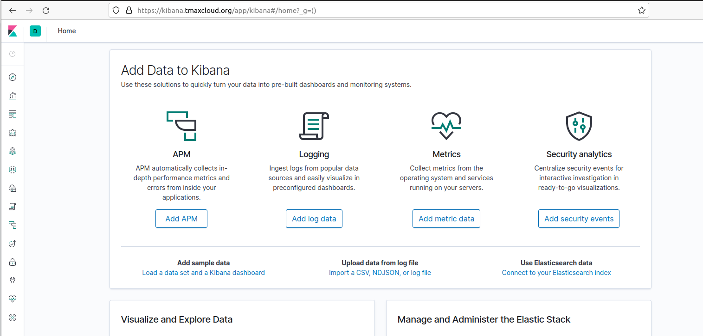

# EFK 설치 가이드

## 구성 요소 및 버전
* elasticsearch ([docker.elastic.co/elasticsearch/elasticsearch:7.2.0](https://www.docker.elastic.co/r/elasticsearch/elasticsearch:7.2.0))
* kibana ([docker.elastic.co/kibana/kibana:7.2.0](https://www.docker.elastic.co/r/kibana/kibana?limit=50&offset=0&show_snapshots=false))
* fluentd ([fluent/fluentd-kubernetes-daemonset:v1.4.2-debian-elasticsearch-1.1](https://hub.docker.com/layers/fluent/fluentd-kubernetes-daemonset/v1.4.2-debian-elasticsearch-1.1/images/sha256-ce4885865850d3940f5e5318066897b8502c0b955066392de7fd4ef6f1fd4275?context=explore))
* busybox ([busybox:1.32.0](https://hub.docker.com/layers/busybox/library/busybox/1.32.0/images/sha256-414aeb860595d7078cbe87abaeed05157d6b44907fbd7db30e1cfba9b6902448?context=explore))

## Prerequisites
* 필수 모듈
  * [RookCeph](https://github.com/tmax-cloud/install-rookceph)
* sidecar injection 사용시
    * [webhook](https://github.com/tmax-cloud/install-hypercloud/tree/5.0)
    * [efk-operator](https://github.com/tmax-cloud/efk-operator)

## Step 0. efk.config 설정
* 목적 : `efk.config 파일에 설치를 위한 정보 기입`
* 순서: 
	* 환경에 맞는 config 내용 작성
		* ES_VERSION
			* ElasticSearch의 버전
			* ex) 7.2.0
		* KIBANA_VERSION
			* KIBANA_VERSION의 버전
			* ex) 7.2.0
		* FLUENTD_VERSION
			* FLUENTD_VERSION의 버전
			* ex) v1.4.2-debian-elasticsearch-1.1
		* BUSYBOX_VERSION
			* BUSYBOX_VERSION의 버전
			* ex) 1.32.0
		* STORAGECLASS_NAME
			* ElasticSearch가 사용할 StorageClass의 이름
            * {STORAGECLASS_NAME} 그대로 유지시 default storageclass 사용
			* ex) csi-cephfs-sc
		* REGISTRY
			* 폐쇄망 사용시 image repository의 주소
			* 폐쇄망 아닐시 {REGISTRY} 그대로 유지
			* ex) 192.168.171:5000

## Step 1. installer 실행
* 목적 : `설치를 위한 shell script 실행`
* 순서: 
	* 권한 부여 및 실행
	``` bash
	$ sudo chmod +x install_EFK.sh
    $ sudo chmod +x uninstall_EFK.sh
	$ ./install_EFK.sh
	```

## 삭제 가이드
* 목적 : `삭제를 위한 shell script 실행`
* 순서: 
	* 실행
	``` bash
	$ ./uninstall.sh
	```

## 수동 설치 가이드
## Prerequisites
1. Namespace 생성
    * EFK를 설치할 namespace를 생성한다.
    ```bash
    $ kubectl create ns kube-logging
    ```
2. 버전 export
    * 다운 받을 버전을 export한다. 
    ```bash
    $ export ES_VERSION=7.2.0
    $ export KIBANA_VERSION=7.2.0
    $ export FLUENTD_VERSION=v1.4.2-debian-elasticsearch-1.1
    $ export BUSYBOX_VERSION=1.32.0
    $ export STORAGECLASS_NAME=csi-cephfs-sc
    ```

* 비고  
    * 이하 인스톨 가이드는 StorageClass 이름이 csi-cephfs-sc 라는 가정하에 진행한다.

## 폐쇄망 설치 가이드
설치를 진행하기 전 아래의 과정을 통해 필요한 이미지 및 yaml 파일을 준비한다.
1. **폐쇄망에서 설치하는 경우** 사용하는 image repository에 EFK 설치 시 필요한 이미지를 push한다. 

    * 작업 디렉토리 생성 및 환경 설정
    ```bash
    $ mkdir -p ~/efk-install
    $ export EFK_HOME=~/efk-install
    $ cd $EFK_HOME
    $ export REGISTRY={ImageRegistryIP:Port}
      ex) $ export REGISTRY=172.22.5.2:5000
    ```
    * 외부 네트워크 통신이 가능한 환경에서 필요한 이미지를 다운받는다.
    ```bash
    $ sudo docker pull docker.elastic.co/elasticsearch/elasticsearch:${ES_VERSION}
    $ sudo docker save docker.elastic.co/elasticsearch/elasticsearch:${ES_VERSION} > elasticsearch_${ES_VERSION}.tar
    $ sudo docker pull docker.elastic.co/kibana/kibana:${KIBANA_VERSION}
    $ sudo docker save docker.elastic.co/kibana/kibana:${KIBANA_VERSION} > kibana_${KIBANA_VERSION}.tar
    $ sudo docker pull fluent/fluentd-kubernetes-daemonset:${FLUENTD_VERSION}
    $ sudo docker save fluent/fluentd-kubernetes-daemonset:${FLUENTD_VERSION} > fluentd_${FLUENTD_VERSION}.tar
    $ sudo docker pull busybox:${BUSYBOX_VERSION}
    $ sudo docker save busybox:${BUSYBOX_VERSION} > busybox_${BUSYBOX_VERSION}.tar
    ```
    * install yaml을 다운로드한다.
    ```bash
    $ wget -O hypercloud-install.tar.gz https://github.com/tmax-cloud/hypercloud-install-guide/archive/v${INSTALL_GUIDE_VERSION}.tar.gz
    ```
  
2. 위의 과정에서 생성한 tar 파일들을 폐쇄망 환경으로 이동시킨 뒤 사용하려는 registry에 이미지를 push한다.
    ```bash
    $ sudo docker load < elasticsearch_${ES_VERSION}.tar
    $ sudo docker load < kibana_${KIBANA_VERSION}.tar
    $ sudo docker load < fluentd_${FLUENTD_VERSION}.tar
    $ sudo docker load < busybox_${BUSYBOX_VERSION}.tar
    
    $ sudo docker tag docker.elastic.co/elasticsearch/elasticsearch:${ES_VERSION} ${REGISTRY}/elasticsearch/elasticsearch:${ES_VERSION}
    $ sudo docker tag docker.elastic.co/kibana/kibana:${KIBANA_VERSION} ${REGISTRY}/kibana/kibana:${KIBANA_VERSION}
    $ sudo docker tag fluent/fluentd-kubernetes-daemonset:${FLUENTD_VERSION} ${REGISTRY}/fluentd-kubernetes-daemonset:${FLUENTD_VERSION}
    $ sudo docker tag busybox:${BUSYBOX_VERSION} ${REGISTRY}/busybox:${BUSYBOX_VERSION}
    
    $ sudo docker push ${REGISTRY}/elasticsearch/elasticsearch:${ES_VERSION}
    $ sudo docker push ${REGISTRY}/kibana/kibana:${KIBANA_VERSION}
    $ sudo docker push ${REGISTRY}/fluentd-kubernetes-daemonset:${FLUENTD_VERSION}
    $ sudo docker push ${REGISTRY}/busybox:${BUSYBOX_VERSION}
    ```

## Install Steps
0. [efk yaml 수정](https://github.com/tmax-cloud/hypercloud-install-guide/tree/master/EFK#step-0-efk-yaml-%EC%88%98%EC%A0%95)
1. [ElasticSearch 설치](https://github.com/tmax-cloud/hypercloud-install-guide/tree/master/EFK#step-2-elasticsearch-%EC%84%A4%EC%B9%98)
2. [kibana 설치](https://github.com/tmax-cloud/hypercloud-install-guide/tree/master/EFK#step-3-kibana-%EC%84%A4%EC%B9%98)
3. [fluentd 설치](https://github.com/tmax-cloud/hypercloud-install-guide/tree/master/EFK#step-4-fluentd-%EC%84%A4%EC%B9%98)

## Step 0. efk yaml 수정
* 목적 : `efk yaml에 이미지 registry, 버전 및 노드 정보를 수정`
* 생성 순서 : 
    * 아래의 command를 사용하여 사용하고자 하는 image 버전을 입력한다.
	```bash
	$ sed -i 's/{busybox_version}/'${BUSYBOX_VERSION}'/g' 01_elasticsearch.yaml
	$ sed -i 's/{es_version}/'${ES_VERSION}'/g' 01_elasticsearch.yaml
    $ sed -i 's/{storageclass_name}/'${STORAGECLASS_NAME}'/g' 01_elasticsearch.yaml
	$ sed -i 's/{kibana_version}/'${KIBANA_VERSION}'/g' 02_kibana.yaml
	$ sed -i 's/{fluentd_version}/'${FLUENTD_VERSION}'/g' 03_fluentd.yaml
    $ sed -i 's/{fluentd_version}/'${FLUENTD_VERSION}'/g' 03_fluentd_cri-o.yaml
	```
* 비고 :
    * `폐쇄망에서 설치를 진행하여 별도의 image registry를 사용하는 경우 registry 정보를 추가로 설정해준다.`
	```bash
	$ sed -i 's/docker.elastic.co\/elasticsearch\/elasticsearch/'${REGISTRY}'\/elasticsearch\/elasticsearch/g' 01_elasticsearch.yaml
	$ sed -i 's/docker.elastic.co\/kibana\/kibana/'${REGISTRY}'\/kibana\/kibana/g' 02_kibana.yaml
	$ sed -i 's/fluent\/fluentd-kubernetes-daemonset/'${REGISTRY}'\/fluentd-kubernetes-daemonset/g' 03_fluentd.yaml
    $ sed -i 's/fluent\/fluentd-kubernetes-daemonset/'${REGISTRY}'\/fluentd-kubernetes-daemonset/g' 03_fluentd_cri-o.yaml
	```    
    
## Step 1. ElasticSearch 설치
* 목적 : `ElasticSearch 설치`
* 생성 순서 : 
    * [01_elasticsearch.yaml](yaml/01_elasticsearch.yaml) 실행
	```bash
	$ kubectl apply -f 01_elasticsearch.yaml
	```     
* 비고 :
    * StorageClass 이름이 csi-cephfs-sc가 아니라면 환경에 맞게 수정해야 한다.

## Step 2. kibana 설치
* 목적 : `EFK의 UI 모듈인 kibana를 설치`
* 생성 순서 : [02_kibana.yaml](yaml/02_kibana.yaml) 실행 
    ```bash
    $ kubectl apply -f 02_kibana.yaml
    ```
* 비고 :
    * kibana pod가 running임을 확인한 뒤 http://$KIBANA_URL에 접속해 정상 동작을 확인한다.
    * $KIBANA_URL은 `kubectl get svc -n kube-logging | grep kibana`를 통해 조회 가능
   

## Step 3. fluentd 설치
* 목적 : `EFK의 agent daemon 역할을 수행하는 fluentd를 설치`
* 생성 순서 : 03_fluentd~.yaml 실행  
  1. Container Runtime이 cri-o 인 경우  
    * [03_fluentd_cri-o.yaml](yaml/03_fluentd_cri-o.yaml) 실행
      ``` bash
      $ kubectl apply -f 03_fluentd_cri-o.yaml
      ```
  2. Container Runtime이 docker 인 경우  
    * [03_fluentd.yaml](yaml/03_fluentd.yaml) 실행 
      ```bash
      $ kubectl apply -f 03_fluentd.yaml
      ```
